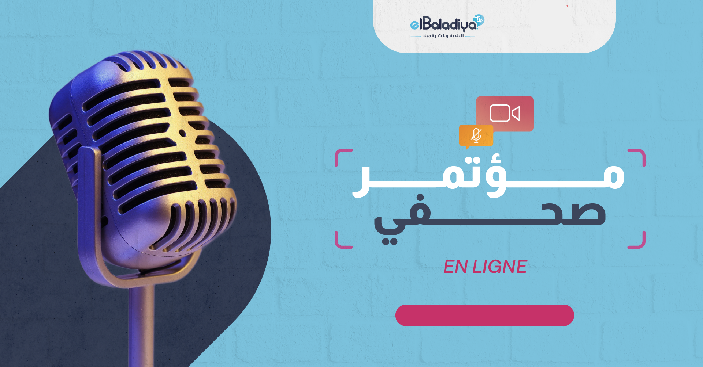
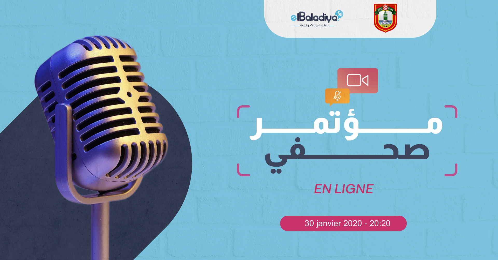

# elBaladiya

---

### Requirements

For development, you will only need NodeJS && (NPM || YARN) installed in your environement.

### Background Image at `./assets/event.png`

### run `./src/index.js event --logo="assets/logo.png" --date="..."`

### Background Image at `./assets/newEvent.png`

